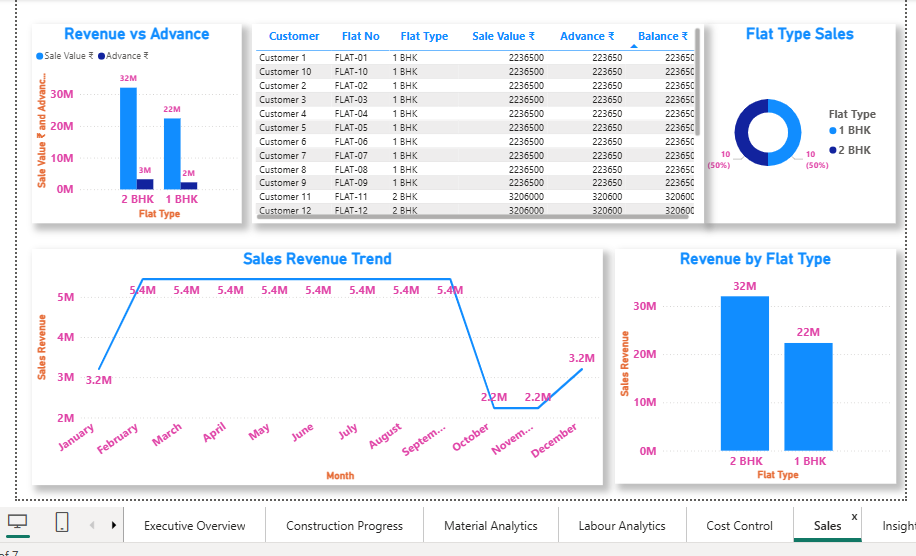

# Construction Project Performance Analytics Dashboard Using Power BI

## 📌 Project Overview

Interactive Power BI dashboard for monitoring construction project performance, budget utilization, labor productivity, project progress, and resource efficiency.

---
## 🎯 Project Objectives

- Monitor project performance
- Track budget utilization
- Analyze labor productivity
- Measure project completion status
- Improve resource utilization
- Identify project delays

---
## 🛠 Tools Used
- Power BI
- Microsoft Excel
- Power Query
- DAX
---

## 📊 Key Performance Indicators (KPIs)

- Average Progress
- Total Labour Cost
- Labour Cost Per Month
- Budget Cost
- Sum of Total Workers
- Actual Cost
- Cost Variance

---

## 📈 Dashboard Features

### Executive Dashboard
- KPI Cards

🏗️ Construction Progress
- Monthly Progress Trend
- Average Project Progress
- Remaining Work 
- Activity-wise Progress Analysis
      - Brickwork
      - Plaster
      - RCC
      - Painting
      - Tiles
      - Plumbing
      - Electrical

🧱 Material Analytics
- Monthly Material Cost Trend
- Material Cost Breakdown
- Material Cost vs Quantity
- Material Consumption Comparison
- Material-wise Consumption (Treemap)

👷 Labour Analytics
- Total Workers
- Total Labour Cost
- Monthly Labour Cost
- Workers by Activity
- Monthly Workers Trend
- Labour Cost Trend

💰 Cost Control
- Budget Cost vs Actual Cost
- Cost Variance Trend
- Budget Cost
- Actual Cost Analysis
- Cost Variance

🏢 Sales Analytics
- Revenue vs Advance Payment
- Flat Type Sales
- Sales Revenue Trend
- Revenue by Flat Type
- Customer Payment Details

---

## 🔍 Key Insights
Construction Progress
- Overall project completion reached approximately 41%, with 59% work remaining.
- Monthly progress increased consistently throughout the project.
- Brickwork and Plaster activities are nearing completion.

Material Analytics
- Bricks accounted for the highest material consumption.
- Material costs increased gradually each month as construction advanced.
- Cement consumption showed a direct relationship with overall material cost.

Labour Analytics
- A total of 1,056 workers contributed across different construction activities.
- Labour costs increased steadily throughout the project timeline.
- RCC activities required the highest workforce allocation.
- Total Workers trend availability remained stable across all months.

Cost Control
- Actual construction costs exceeded the planned budget by approximately ₹2M.
- Monthly cost variance increased steadily, indicating rising project expenses.

Sales Analytics
- 2 BHK flats generated significantly higher revenue than 1 BHK flats.
- Sales revenue remained strong during the middle months before declining toward project completion.

---

## 💡 Business Recommendations

- Monitor project costs monthly to protect profit margins.
- Convert booked flats into completed sales quickly.
- Focus marketing efforts on the remaining available inventory.
- Continue monitoring activity-wise progress.
- Prioritize finishing activities such as plumbing, electrical, and tiles to avoid delays near project completion.
- Set milestone-based tracking for each activity.
- Negotiate long-term supplier contracts for cement and bricks.
- Track material wastage regularly.
- Optimize labour allocation across activities.
- Monitor labour productivity per activity.
- Track labour cost per square foot constructed.
- Prioritize marketing of 2 BHK flats due to higher revenue potential.
- Monitor booking-to-sale conversion rates.

---

## 📷 Dashboard Preview

### Executive Dashboard

### Construction Progress

### Materials Analytics

### Labour Analytics

###  Cost Control

###  Sales

###  Key and Recommandation

---

## 📁 Files Included
- Construction Project Performance Analytics Dashboard - Power BI.pbix
- Sangli_Construction_PowerBI_2Year_Dataset.xlsx
- Executive overview.png
- Construction Progress.png
- Materials Analytics.png
- Labour Analytics.png
- Cost Control.png
- Sales.png
- Key and Recommandation.png
---

## 👩‍💻 Author

**Sayali Takale**

LinkedIn: https://www.linkedin.com/in/sayali-takale-data-analyst

GitHub: https://github.com/sayalitakale1234
